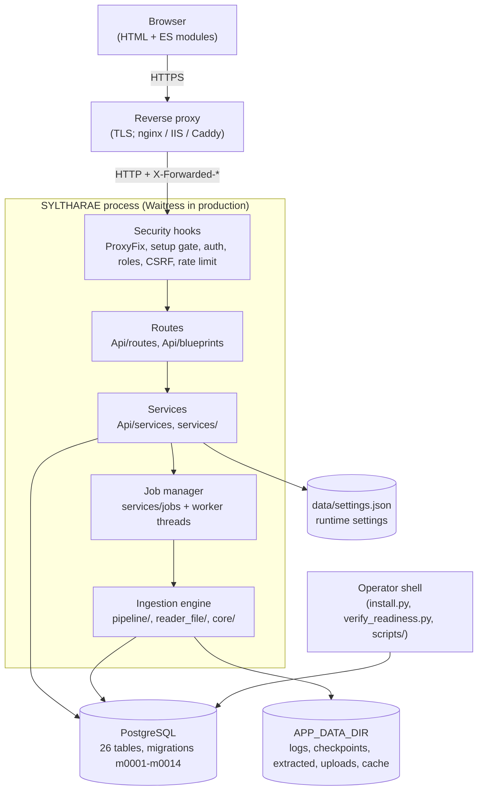
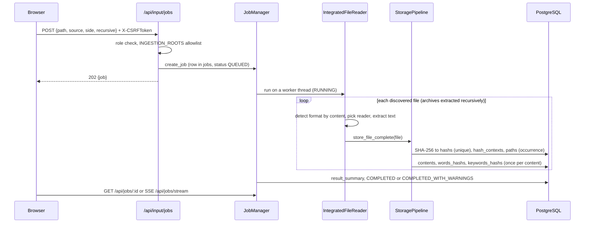
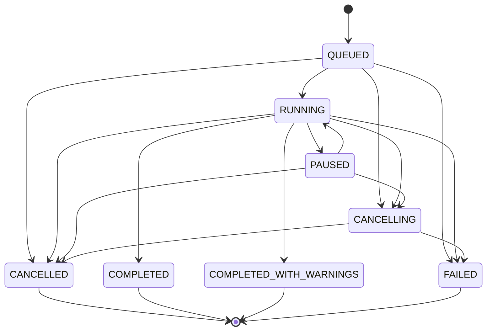

# Architecture

SYLTHARAE is a self-hosted, offline-capable evidence and document analysis
platform. It ingests files and folders (including archives and mailboxes),
identifies what each file really is, extracts text and forensic metadata,
de-duplicates content across sources, indexes words and keywords in
PostgreSQL, and serves search, analytics, categorisation and review through
a Flask web application in English, Arabic, Hebrew, Persian and Croatian.

This document is the map. The per-module detail is generated in
[reference/](reference/README.md), the data model is in
[DATABASE.md](DATABASE.md) and [DOMAIN_MODEL.md](DOMAIN_MODEL.md), and the
security design in [SECURITY.md](SECURITY.md).

## 1. System context



There is one process type. Background work runs on threads inside the web
process, coordinated by `core/resource_coordinator.py`, and is persisted in
the `jobs` table so it survives a restart.

## 2. Repository layout

| Path | Role |
| --- | --- |
| `run_web.py`, `start.bat` | Web entry point (the primary interface). |
| `install.py`, `setup.bat`, `core/installer.py` | Installation: prerequisites, `.env`, database, migrations, first admin. |
| `verify_readiness.py` | Behavioural production-readiness verification. |
| `run_cli.py`, `run_import.py`, `apps/cli/`, `apps/importing/` | Deprecated command-line adapters over the same services the web UI uses. |
| `apps/web/app.py` | Builds the Flask app: config, Babel, CSRF, rate limiter, compression, security headers, auth, route registration. |
| `Api/routes/`, `Api/blueprints/` | HTTP layer: one module per area (auth, search, archives, analytics, operations, settings, experience, ...). `Api/routes/__init__.py::register_all_routes` wires them. |
| `Api/services/`, `Api/repositories/`, `Api/models/`, `Api/utils/` | Request-facing business logic and read models (search, preview, lineage, export, translation management). |
| `services/` | Long-running services: `ingesting/` (ingestion requests), `jobs/` (persistent job system), `importing/` (structured domain imports), `sources.py`. |
| `pipeline/` | The ingestion engine: `integrated_reader.py` (parallel traversal, archives, progress), `storage_pipeline.py` (hash, dedup, extract, store), `progress_ledger.py`. |
| `reader_file/` | Format readers (`readers/read_pdf.py`, `read_office.py`, `read_email.py`, `read_archive.py`, `read_img_fast.py`, `read_audio.py`, `read_video.py`, `read_ebook.py`, `read_database.py`, `read_diagram.py`, `read_remaining.py`) and the extension router `main_specify_method.py`. |
| `core/` | Shared foundations: `security/`, `interfaces/` (registry), `experience/`, `frontend/` (component audit), `formats/` (content-based type detection), `forensics/`, `ocr/`, `compute/` (CPU/GPU gateway), `monitoring/`, `validation/`, `archive_safety.py`, `path_safety.py`, `sql_safety.py`, `hashing.py`, `app_paths.py`, `init.py`. |
| `database/` | Connection pool (`database/database/`), repositories, `services/contents_db_service.py` and `services/dedup_service.py`, and the numbered migrations `database/migrations/m0001`-`m0014`. |
| `settings/` | Unified settings manager (`data/settings.json`) and interface state. |
| `concurrency/` | Thread, process, async and pool managers used by the engine. |
| `Hdg_Err_Ex_Log/` | Unified error handling, classification and logging. |
| `templates/`, `static/` | Jinja2 templates (66) and front-end assets: `static/js/pages/*-page.js` (one ES module per screen), `static/js/modules/` (shared), CSS, vendored Bootstrap Icons, select2, jsPDF. |
| `translations/` | Babel catalogs (`ar`, `en`, `fa`, `he`, `hr`); `.po` sources and compiled `.mo`. |
| `offline-bundle/` | Requirements and wheel directory for air-gapped installs. |
| `tests/` | `unit/`, `integration/`, `security/`; a disposable PostgreSQL via `pgserver`. |
| `tools/`, `scripts/` | Documentation generators, scalability tools, admin recovery. |

## 3. Start-up sequence

1. **`run_web.py`** optionally installs missing wheels from `wheels/`
   (`AUTO_INSTALL`), then calls **`core.init`**: load settings
   (env > `.env` > `data/settings.json` > `config.example.json` > defaults),
   start the resource coordinator, and apply any pending migrations when the
   database is reachable (an unreachable database is reported, not fatal, so
   the setup wizard can still run).
2. **`apps/web/app.py`** builds the application:
   * Flask with `templates/` and `static/`; `ProxyFix` only when
     `TRUSTED_PROXY_COUNT` > 0;
   * Flask-Babel (locale from the session, then system settings, then the
     browser's `Accept-Language`; RTL for `ar`, `fa`, `he`);
   * `SECRET_KEY` from `FLASK_SECRET_KEY` or a generated `.flask_secret_key`;
     session cookies `HttpOnly`, `SameSite=Lax`, `Secure` in production;
   * `CSRFProtect`, the rate limiter (`core/security/rate_limit.py`) and gzip
     compression;
   * `init_auth` (the default-deny hooks), then `ensure_initial_admin`;
   * route registration - auth, setup, the `Api/blueprints/*` blueprints,
     `register_all_routes`, the archive/cursor/concurrency/translation/health
     blueprints, operations, experience and interface APIs;
   * the interface registry, experience contract and interface APIs are
     registered (the registry itself is validated against the URL map by the
     test suite and by `python3 -m core.interfaces.evidence`).
3. `run_web.py` refuses to serve with debug enabled in production, then
   serves on `FLASK_HOST:FLASK_PORT`.

## 4. Request lifecycle

For every request, in order:

| Stage | Where | What happens |
| --- | --- | --- |
| Proxy headers | `ProxyFix` (opt-in) | Client address, scheme and host from `X-Forwarded-*`. |
| Setup gate | `Api/routes/setup.py` | Until installation finishes, everything except the wizard, static files and the CSRF endpoint redirects to `/setup`. |
| Authentication | `core/security/flask_ext.py` | Loads the user from the opaque session token (validated against `sessions`, idle and absolute expiry). Anonymous: 401 for `/api/*`, redirect to `/auth/login` for pages, unless the endpoint is in `PUBLIC_ENDPOINTS`. An account with a temporary password (`must_change_password`) can reach only the change-password flow and the home page until it has changed it. |
| Authorisation | `flask_ext._enforce_role_policy` | Safe methods: any authenticated user, except admin-read blueprints (settings, concurrency, error dashboard). Mutations: analyst or admin; admin blueprints: admin only. View decorators may only tighten. |
| CSRF | Flask-WTF | Every POST/PUT/PATCH/DELETE needs `X-CSRFToken` (or a form field). |
| Rate limit | Flask-Limiter | Per client address; defaults 60/min and 600/h, stricter on login. |
| View | `Api/routes/*` | Validates input, calls a service, returns HTML or JSON. |
| Errors | `apps/web/app.py` | 404/500/CSRF handlers return a generic message; details go to the log (`Hdg_Err_Ex_Log`), never to the client. |
| Headers | `after_request` hooks | CSP, `X-Frame-Options: DENY`, `nosniff`, `Referrer-Policy`, `Permissions-Policy`, COOP, HSTS (production + HTTPS); `no-store` for pages and `/api/*`, a one-year immutable cache for static files. |

## 5. Ingestion pipeline

The same engine serves the **Input** page, the jobs API and the CLI adapter.



The same flow as a component tree:

```
IngestionService (services/ingesting)      validate request, path-safety (INGESTION_ROOTS)
   └─ JobManager (services/jobs)           persistent job row, worker thread, pause/cancel
        └─ IntegratedFileReader (pipeline/integrated_reader.py)
             ├─ walk folders; ProgressLedger counts discovered/done/skipped
             ├─ archives → core/archive_safety.py (zip, tar, 7z, rar) into
             │            APP_DATA_DIR/extracted/, recursively, with limits
             ├─ core/formats: identify by content (magic bytes, containers)
             ├─ reader_file router → the matching reader (PDF, Office, e-mail,
             │            images + OCR, audio, video, e-books, databases, ...)
             └─ StoragePipeline.store_file_complete (pipeline/storage_pipeline.py)
                  1. streamed SHA-256 of the file = content identity
                  2. occurrence-level duplicate check (DedupService)
                  3. metadata: name, size, type, dates, coordinates, provenance,
                     parent/child hierarchy for extracted members
                  4. text: ContentProcessor tokenises (chunked for very large
                     text) → ContentDBService.process_full_document():
                     hashs, hash_contexts, paths, contents/contents_raw,
                     words + words_hashs, keywords_hashs, titles_content
                  5. status per path (processing_status, status_detail, attempts);
                     transient DB errors are retried, others recorded
```

Key properties:

* **One content, many contexts.** `hashs.hash` is unique; `hash_contexts`
  holds each (hash, source, side) context; `paths` holds each occurrence.
  Text is extracted and indexed once per content, however many copies exist.
  `database/services/dedup_service.py` is the only place these identities
  are defined.
* **Crash safety.** Checkpoints under `APP_DATA_DIR/checkpoints/` let a run
  resume; on start the job manager marks `RUNNING` jobs that stopped
  updating as `FAILED`, and dedup keeps a resumed run from storing a file twice.
* **Bounded resources.** Worker counts come from the resource coordinator
  and `COMPUTE_MODE`; each file has a time budget proportional to its size;
  archive extraction enforces depth, member-count, total-size, per-file-size,
  compression-ratio and time limits, and rejects unsafe member paths.
* **Honest progress.** Progress is derived from worker state and the ledger,
  never estimated.

## 6. Jobs

`services/jobs/` is the single job system for ingestion, imports and other
long work:

* `job_state.py` - a pure state machine: `QUEUED → RUNNING`, `RUNNING ⇄
  PAUSED`, `→ CANCELLING → CANCELLED`, and the terminal states `COMPLETED`,
  `COMPLETED_WITH_WARNINGS`, `FAILED`, `CANCELLED`; unit-tested without a
  database;
* `manager.py` - worker threads with explicit concurrency limits, cooperative
  pause/cancel at file boundaries, stale-job recovery;
* `repository.py` - the `jobs` and `job_events` tables (migration 0006);
* events stream to the Operations → Jobs page by Server-Sent Events, with
  polling as the fallback.

The state machine, exactly as `TRANSITIONS` in `services/jobs/job_state.py`
defines it (`tests/unit/test_architecture_diagrams.py` keeps the two in step).
A retry never reopens a job: it creates a new `QUEUED` job with the same options.



## 7. Front end

* **Server-rendered shell.** Every page extends `templates/base.html` (sidebar
  from the Interface Registry, user menu, CSRF meta tag, theme, language and
  direction). Shared markup lives in `templates/components/` (see
  [COMPONENT_LIBRARY.md](COMPONENT_LIBRARY.md)).
* **One module per screen.** `static/js/pages/<screen>-page.js` is an ES
  module loaded by its template. Shared code is under `static/js/modules/`:
  `core/` (CSRF via `window.CSRF`, `escapeHtml`/`escapeAttribute` in
  `utils.js`, language persistence), `api/`, `search/`, `views/`, `modals/`,
  `charts/`, `upload/` (chunked uploads), `navigation/`, `ui/`.
* **Rules** enforced by tests: data is written to the DOM through
  `textContent` or an escaper, never raw `innerHTML`; every mutating `fetch`
  sends `X-CSRFToken`; no inline `onclick` in components; every Bootstrap
  icon a template names must exist in the bundled font (offline installs).
* **Registries on the page.** Navigation, page help, shortcuts, the action
  toolbar and the Screen Inspector are generated from the Interface Registry,
  the Experience Contract and the Action Registry (`core/interfaces/`,
  `core/experience/`), not hand-written per page.

## 8. Internationalisation

Server strings use Flask-Babel (`translations/<locale>/LC_MESSAGES/messages.po`,
compiled to `.mo`). JavaScript gets the same catalogue from
`/api/i18n/catalog`. Administrators can override single strings from the
Translation Management page; overrides are stored in `translation_overrides`
and win over the catalogue. After editing a `.po` file:

```bash
pybabel compile -d translations
```

`tests/integration/test_translation_coverage.py` fails when a compiled
catalogue is missing strings from its source.

## 9. Configuration and settings

* **Static configuration** (connection, secrets, network, limits) comes from
  the environment chain in [INSTALL.md](INSTALL.md#step-5---configure).
* **Runtime settings** (processing, UI, interface switches, feature flags)
  live in `data/settings.json`, managed by `settings/settings_manager.py` and
  edited on the admin-only Settings page.
* **Paths** all derive from `core/app_paths.py` (`APP_DATA_DIR`); no module
  depends on the working directory.

## 10. Errors, logging and monitoring

* `Hdg_Err_Ex_Log/` classifies exceptions (transient vs permanent,
  subsystem), logs them with context and feeds the admin-only Error
  Dashboard (`/api/errors/*`).
* HTTP responses carry a generic message and a code (`client_error`), never
  exception text.
* Logs go to `APP_DATA_DIR/logs/`. `core/monitoring/` provides performance
  counters, notifications (the `alerts` table) and `/health`.

## 11. Extending SYLTHARAE

| To add | Do this |
| --- | --- |
| A file format | Add a reader in `reader_file/readers/`, route its extension(s) or detected type in `reader_file/main_specify_method.py` / `core/formats/`, and add a fixture test in `tests/unit/`. |
| A screen | Template extending `base.html`, a `static/js/pages/*-page.js` module, a route, **and** a registry entry (see [INTERFACE_REGISTRY.md](INTERFACE_REGISTRY.md)); regenerate the docs. |
| An API endpoint | A function in the right `Api/routes/` module. It is authenticated and role-checked by default; add it to `PUBLIC_ENDPOINTS` only with a written reason. Validate input, use parameterised SQL (`core/sql_safety.py` for identifiers), return `client_error` on failure. |
| A table or column | A new `database/migrations/mNNNN_*.py` (never edit an applied one); migrations run automatically on start and in the installer. Document it in [DATABASE.md](DATABASE.md). |
| A setting | A field in the `settings/` dataclasses, with its default and validation; expose it on the Settings page if users should change it. |
